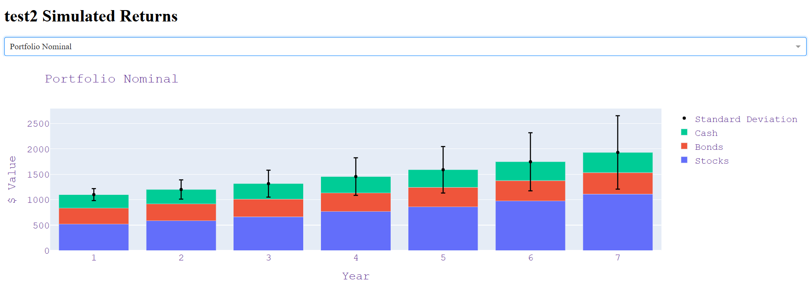

# portfolio_app

[virtuallystatistical.com](virtuallystatistical.com)

This application is an interactive portfolio simulator intended for entertainment purposes and is in no way supposed to be taken as financial advice or used in place of a professional financial assessment. This simulation is a crude 
estimation that exists to give people a general understanding of how broad asset classes (stocks, bonds, & cash or cash equivalents) will behave within a hypothetical portfolio. 

This application uses a variety of inputs (average annual stock/bond returns and standard deviation, inflation, investment time horizon, etc…) and then runs a Monte Carlo simulation to determine how a given portfolio of generalized asset
types would perform, and then displays the results within a plotly dashboard page.

All default input values are taken from the historical averages given in Financial Reporting and Analysis by Lawrence Revsine et all, but can be modified by the user to create highly variable simulation results.

The goal of this app is to give users a simplified playground to see the impacts of these inputs without getting too far into the weeds when it comes to asset selection or expectations of market conditions.

This app uses mongoDB for storage of all user/account information.

More info and a guided walkthrough available on the website.
